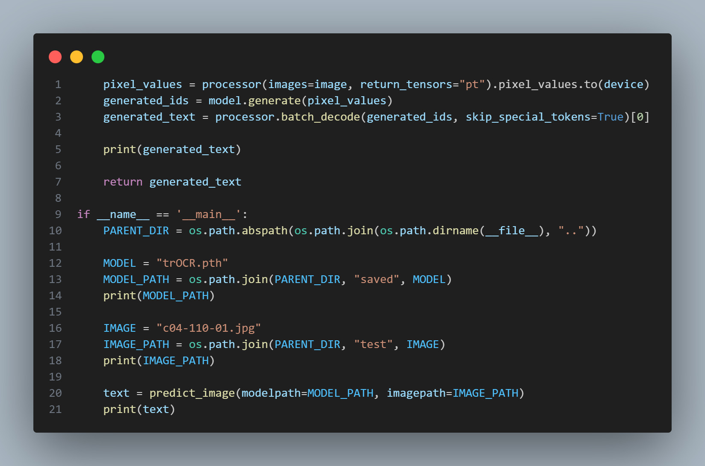

## Problem Description

This project aims to build an application that can recognize **handwritting text**, then converts them to digital text that can editable.

- Dataset: **IAM Handwriting Database**: https://fki.tic.heia-fr.ch/databases/iam-handwriting-database. 
    
    > This cannot be reachable, so we use the processed dataset from **Kaggle**: https://www.kaggle.com/datasets/nibinv23/iam-handwriting-word-database

- Method: **Transformers**

## Installation

**1. Clone project**

Open your **Command line**, **Terminal**, **Powershell** and run this command:

```
git clone https://github.com/dtruong46me/handwritten-text-recognition.git
```

**2. Download model**

Since our model is too large, so you need to download manually.

- Base model: [donut.pth](https://drive.google.com/uc?export=download&id=1uHg_oCziqJdtcyZSLCxQ1v3iJ6BqPtxR&fbclid=IwAR234bt9stl6xbBQAaOBp2x3KevlIg0DSTMWk8RKq8Qz8zCBgpgEzRnKkrI) (1.5 GB)

- Our model: [trOCR.pth](https://drive.google.com/u/0/uc?id=1RF29mLXanE5Ze6J7qqhWlcK6DIgdfGo4&export=download) (1.4 GB)

> Your downloaded model should be located in `src/saved/your_model.pth`

Example:
```
..
└───src
    ├───..
    ├───saved
    │   └───trOCR.pth
    │   └───donut.pth
    ├───..
```

In file `src/utils/predict.py`, handle your model you downloaded in the **line 12**

```
MODEL = "model_downloaded.pth"
```



**3. Change directory to repository & execute `main.py`**

Make sure that you are in this directory
`..\handwritten-text-recognition>` to execute this project

Install the libraries in `requirements.txt`:

```
pip install -r requirements.txt
```

```
python main.py
```

## Contributions

|Name|Student ID|Email|
|-|-|-|
|Vu Tuan Minh (C)|20210597|minh.vt210597@sis.hust.edu.vn|
|Le Tuan Anh|20214874|anh.lt214874@sis.hust.edu.vn|
|Bui Minh Quang|20214925|quang.bn214925@sis.hust.edu.vn|
|Dinh Nguyen Cong Quy|20214927|quy.dnc214927@sis.hust.edu.vn|
|Phan Dinh Truong|20214937|truong.pd214937@sis.hust.edu.vn|

## References
